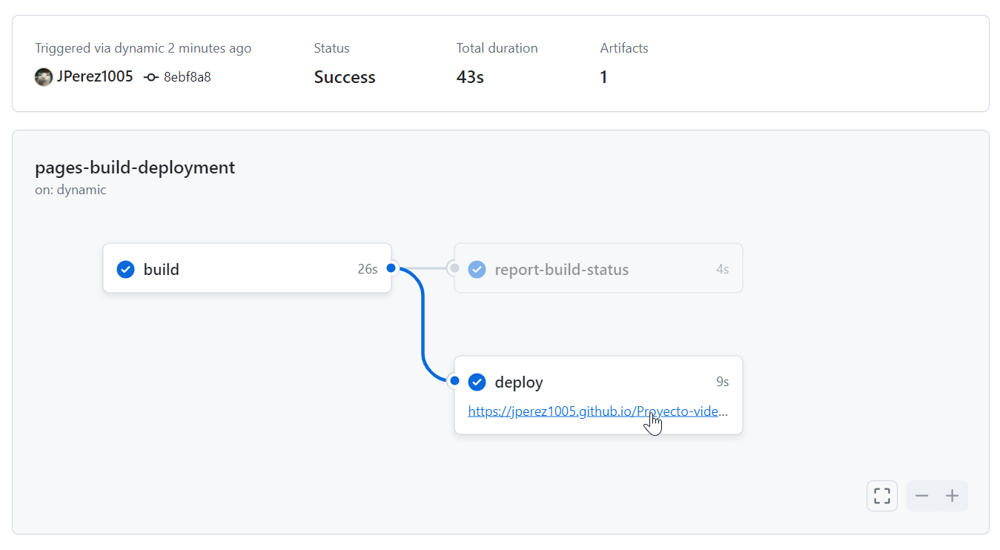

# Proyecto videojuegos

Este es un proyecto de javaScriptmtotalmente orientado al frontend, pero cuenta con un almacenamiento en memoria, para poder ingresar se necesita lel usuario como contraseña

## Pagina de inicio

esta pagina cuenta con una funcionalidad llamada mousemove de javascript

### Datos de ingreso

**Usuario:JulianPerez**
 

**Contraseña:123456789**

## En el ingreso

nos encontramos con un fondo de pantalla el cual es movible gracias a gsap y javascript

es una pagina web con muchas funcionalidades

### Gestiona clientes

### GEstion videojuegos

### funcionalidades
ya que tiene un guardado de datos en memoria todos los clientes y videojuegos con los datos registrados quedan guardados, la pagina web es responsive y adaptable a todos los computadores

## como probar la pagina web
Para poder probar la pagina web si tener que descargarla, por favor dirigase a la sección de actions en el git hub

aquí encontrará multiples pruebas que hice con esta pagina mas sin embargo dirigase a la más actual

le generará un link que solo tiene que presionar con click para poder ingresar a la prueba de la pagina web

# Gracias por su Atención!
